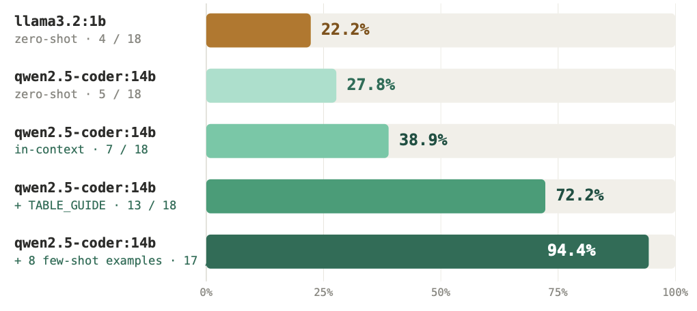

# Text-to-SQL LLM Evaluation - Football World Cup Dataset

Evaluating LLM-based text-to-SQL conversion on a football (soccer) World Cup database using a multi-step LangGraph pipeline.

**Course**: IIS2, DWH2_Project - ZHAW, FS26
**Team**: Johnson Michal, Kryeziu Leona, Wagner Bjoern

## Overview

This project builds a natural language to SQL pipeline that:

1. Accepts a football-related question in plain English
2. Selects relevant tables from a 15-table PostgreSQL schema
3. Generates a SQL query using few-shot prompting
4. Executes the query with automatic error correction (up to 2 retries)
5. Returns a natural language answer

The pipeline is implemented as a **LangGraph** state graph and supports both local (Ollama) and cloud (OpenAI) LLMs.

## Architecture

```
Question
   |
[1] select_tables  ->  Identify relevant tables from schema
   |
[2] generate_sql   ->  Generate PostgreSQL SELECT query (few-shot)
   |
[3] execute_sql    ->  Run query against database
   |-- error (retry < 2) -> [4] fix_sql -> retry execute_sql
   |-- success            -> [5] generate_answer
                                |
                          Natural language answer
```

## Database Schema

The `exp_v3` PostgreSQL schema contains 15 tables covering FIFA World Cup data:

| Table                      | Description                               |
| -------------------------- | ----------------------------------------- |
| `world_cup`              | Tournament info (year, venue, attendance) |
| `world_cup_result`       | Winners and runners-up                    |
| `national_team`          | National team rosters per year            |
| `player`                 | Player profiles                           |
| `player_fact`            | Player-national team links                |
| `match_fact`             | Per-player match stats (goals, cards)     |
| `plays_match`            | Match-level data (stage, score, stadium)  |
| `national_opponent_team` | Opponent teams in matches                 |
| `stadium`                | Stadium information                       |
| `club`                   | Football clubs                            |
| `club_league_history`    | Club league participation                 |
| `coach`                  | Coach profiles                            |
| `coach_club_team`        | Coach-club assignments                    |
| `player_club_team`       | Player-club assignments                   |
| `league`                 | League information                        |

## Dataset

- **Training set** (`data/train.json`): 100 questions with gold SQL queries
- **Validation set** (`data/dev.json`): 100 questions with gold SQL queries

Difficulty distribution (per set): ~9 easy, ~19 medium, ~36 hard, ~36 extra-hard.

For evaluation we use a **hand-selected subset of 18 questions** from `data/dev.json`,
balanced across difficulty levels (3 easy / 6 medium / 5 hard / 4 extra-hard) so that
half are easy/medium and half are hard/extra-hard.

## Setup

### Prerequisites

- Python 3.x
- PostgreSQL with the `exp_v3` schema loaded
- [Ollama](https://ollama.ai/) (for local LLM) or an OpenAI API key

### Installation

```bash
git clone https://github.com/bjoern555/dwh2-text-to-sql.git
cd dwh2-text-to-sql

pip install "sqlalchemy>=2" psycopg2-binary \
    langchain-core langchain-community langchain-ollama langchain-openai \
    langgraph python-dotenv pandas
```

### Configuration

Create a `.env` file in the project root:

```env
DB_USER=your_username
DB_PASSWORD=your_password
DB_HOST=localhost
DB_PORT=5432
DB_NAME=your_database

LLM_PROVIDER=ollama
OLLAMA_MODEL=qwen2.5-coder:14b
OPENAI_MODEL=gpt-4o-mini
OPENAI_API_KEY=sk-...
```

If using Ollama, start the model first:

```bash
ollama run qwen2.5-coder:14b
```

### Running

Open and run the Jupyter notebook:

```bash
jupyter notebook football_text_to_sql.ipynb
```

Query examples:

```python
# Single question
run_query("Which club was founded first and in which year?")

# Full evaluation on the test set
eval_results = evaluate(TEST_SET, verbose=True)
```

## Results

Evaluated using **execution accuracy** — the predicted query is correct iff
its executed result set matches the gold result set exactly.



### Iteration progression (18-question test set)

| Configuration                                | Accuracy                   |
| -------------------------------------------- | -------------------------- |
| llama3.2:1b, zero-shot                       | 22.2%  (4 / 18)            |
| qwen2.5-coder:14b, zero-shot                 | 27.8%  (5 / 18)            |
| qwen2.5-coder:14b + in-context               | 38.9%  (7 / 18)            |
| qwen2.5-coder:14b + TABLE_GUIDE              | 72.2%  (13 / 18)           |
| qwen2.5-coder:14b + TABLE_GUIDE + 8 few-shot | **94.4%  (17 / 18)** |

The single remaining error in the final run was an extra column in the SELECT,
not a wrong result.

### Generalization check (held-out 18 questions)

To test whether the final pipeline generalizes or overfits to the
development questions, we ran it on a second held-out subset of 18 unseen
questions from `data/dev.json`.

| Metric             | Score           |
| ------------------ | --------------- |
| Execution Accuracy | 50.0%  (9 / 18) |

The drop from 94.4% → 50.0% indicates partial overfitting to the tuned set.

### What worked, what didn't

**Biggest wins**: adding the `TABLE_GUIDE` (schema description with usage
hints) and 8 curated few-shot examples — together they took the pipeline
from 27.8% to 94.4%.

**Remaining weakness**: aggregation logic (`SUM` / `COUNT` / `GROUP BY`) on
unseen question shapes — 4 of the 9 held-out errors come from this
category.

## Project Structure

```
dwh2-text-to-sql/
├── football_text_to_sql.ipynb   # Main implementation & evaluation
├── data/
│   ├── train.json               # 100 training questions
│   └── dev.json                 # 100 validation questions
├── docs/
│   ├── DHW2_Wagner_Kryeziu_Johnson.pptx   # Final presentation (slides)
│   ├── Final Project-2026.pdf             # Assignment brief
│   ├── Football dataset.pdf               # Dataset documentation
│   └── StatbotSwiss Dataset.pdf           # Alternative dataset reference
├── image/                       # README assets
├── .env                         # DB & LLM config (gitignored)
└── README.md
```

## Technologies

- **LangChain** + **LangGraph** - LLM orchestration and multi-step pipeline
- **PostgreSQL** - Database backend
- **Ollama** / **OpenAI** - LLM providers
- **SQLAlchemy** - Database connectivity
- **Python / Jupyter** - Implementation environment
